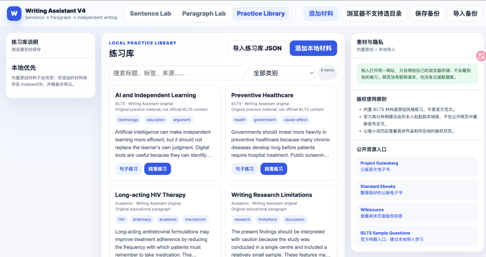

# Writing Assistant

> **Sentence → Paragraph → Independent Writing**

一个本地优先的英语写作练习工具，帮助学习者从句子仿写逐步进入段落论证和独立写作。无需账号、后端数据库或 AI API。

**在线体验：** https://writing-assistant.ccwu.cc/

[English README](README.md)



## 为什么做这个项目

很多学习者还没有接受句子和段落训练，就被要求直接完成整篇作文。Writing Assistant 将英文写作拆成一条渐进路径：

1. 观察并仿写有用的句子结构；
2. 判断每一句在段落中承担什么功能；
3. 从观点、原因、机制、例子和限定搭建段落；
4. 逐渐撤掉辅助，进入独立写作；
5. 将自己的练习一键复制到 GPT 对话中接受反馈和重写。

## 主要功能

- **Sentence Lab**：精准跟写、结构仿写、自动拆分、纯前端规则分析，以及适合粘贴给 GPT 的反馈格式。
- **Paragraph Lab**：逐句功能标注、引导式段落搭建、骨架迁移和独立段落训练。
- **Practice Library**：内置原创材料，并支持导入 TXT、Markdown、EPUB、DOCX、PDF 和练习库 JSON。
- **本地优先**：每位访问者的练习、笔记和自建材料保存在自己的浏览器中；支持 JSON 备份与恢复。
- **可选的BYOK原文解析**：AI只解析选中的范文、小说节选、论文或其他参考文本，不发送或评价使用者的仿写内容。
- **不需要注册账号**：每位访问者获得相互独立的本地练习空间。

## 0.8.0 M2 文档导入与管理

浏览器现在可以在本地解析以下文件：

- EPUB：读取书籍元数据、spine 顺序和 HTML/XHTML 章节；
- DOCX：通过 Mammoth 提取语义标题和正文；
- PDF：通过 PDF.js 提取已有文字层，并判断文件是否疑似扫描件；
- TXT 与 Markdown：继续使用0.7.0的章节、批次和进度系统。

所有文档都会先进入导入预览，使用者可以检查元数据、选择章节、重命名、调整顺序、完整编辑正文、拆分或合并章节，并选择保存到哪个本地练习库文件夹。已经导入的文档也可以从卡片重新打开编辑。源文件不会上传给项目维护者。

M1暂不包含扫描PDF的OCR。0.8.0后续检查点会提供可选的PaddleOCR-VL本地连接器，普通使用者不需要安装。

### M2文档管理与进度保护

- 每张卡片都可以修改显示标题；内置材料使用当前浏览器的本地覆盖，并可恢复默认标题。
- 导入文档卡片可以重新打开元数据与章节编辑器。
- 只重命名或调整顺序时保留章节ID和已有进度。
- 修改正文、合并、拆分或删除章节时，只清除与新原文不再对应的章节进度，并在保存前明确确认。
- 预览页显示已选词数、字符数、预计句子/段落单元与45单元批次数量。
- PDF导入会提示疑似扫描页、混合文字层和可能的双栏版式。

## 隐私与安全模型

公开网站只包含程序代码和内置练习材料。

- 练习原文、答案、笔记和自建材料通过 `localStorage` 与 `IndexedDB` 保存在访问者自己的浏览器中。
- 不同访问者无法读取彼此的本地练习数据。
- 项目没有云端数据库、统计脚本或用于修改线上代码的公开接口。
- 访问者通过浏览器开发者工具修改页面，只会影响他自己的当前页面或本地存储。
- GitHub 仓库公开后，普通访问者不会因此获得 Cloudflare 账户权限。
- 只有维护者主动部署新 Worker，或以后明确配置了可信 CI/CD 自动部署，线上网站才会发生变化。

详见 [PRIVACY.md](PRIVACY.md)、[SECURITY.md](SECURITY.md) 与 [BYOK AI配置说明](docs/AI_CONFIGURATION.md)。

## 本地运行

建议通过本地服务器打开：

```bash
python3 -m http.server 8080
```

然后访问 `http://localhost:8080`。


## 0.8.0过渡期部署

本地测试时可以直接启动HTTP服务器；如果还没有安装解析依赖，网页会从固定版本CDN载入解析器代码，但不会把使用者选择的文档发送到CDN。

正式部署前运行：

```bash
npm install
npm run build:site:full
npm run deploy
```

项目现在包含`wrangler.jsonc`，并将`dist/site`作为Cloudflare Static Assets部署。旧的单文件Worker暂时仍可通过`npm run build:worker`生成，但0.8.0最终版推荐使用静态资源部署。

详见[文档导入说明](docs/DOCUMENT_IMPORT.md)和[Cloudflare静态资源部署](docs/CLOUDFLARE_STATIC_ASSETS.md)。


## 素材与版权

内置 IELTS 风格文本均为原创练习材料，不是 IELTS 官方范文。用户导入第三方文章或书籍前，应自行确认版权和许可状态。请勿未经许可公开再发布受版权保护的完整范文或作品。

## 参与贡献

欢迎提交 Bug 和边界清晰的改进。请阅读 [CONTRIBUTING.md](CONTRIBUTING.md)。外部贡献者提交 Pull Request 并不会自动改变线上网站，必须由维护者审查、合并并重新部署。

## 许可证

代码使用 [MIT License](LICENSE)。内置原创练习材料可随本项目用于学习和二次开发，建议保留来源说明；用户自行导入的第三方材料仍受原版权和许可约束。

## AI原文解析边界

启用后，AI只解析当前选中的参考句子或参考段落，例如范文、小说节选、论文或其他练习文本。使用者的仿写、笔记、标签、写作计划和练习进度不会发送给服务商，也不会被AI评价。

网页原有的练习复制功能不会附带AI解析结果。解析内容独立显示并缓存在当前浏览器中。

## 0.8.0 M3：在线公共资源与可收缩目录

- 练习库侧栏中的所有父文件夹均可单独展开或收起，包括“全部材料”。
- 展开状态保存在当前浏览器中，也会随普通JSON备份导出。
- 在线资源中心内置40个仅含元数据的精选入口，并支持用户主动搜索英文Wikipedia和Wikisource。
- 在线正文必须先经过本地章节预览，用户确认后才保存。
- Wikimedia请求不会包含用户仿写、笔记、AI密钥或练习进度。

详细边界见 `docs/ONLINE_RESOURCES.md` 与 `docs/FOLDER_NAVIGATION.md`。
