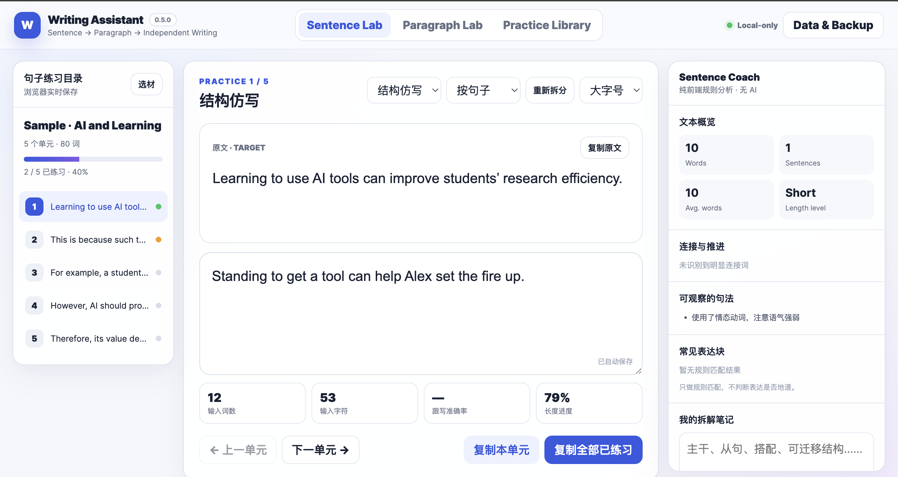
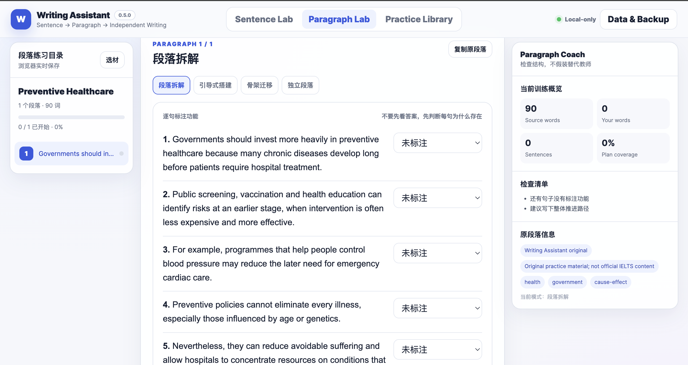
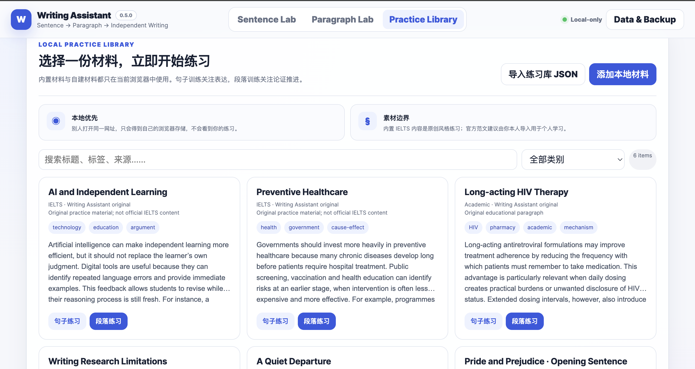

# Writing Assistant

> **Sentence → Paragraph → Independent Writing**

一个本地优先的英语写作练习工具。核心练习无需账号、后端数据库或AI；可选BYOK只解析使用者主动选择的参考文本。

**在线体验：** https://writing-assistant.ccwu.cc/

[English README](README.md)

## 界面预览

### Sentence Lab · 句子训练

支持精准跟写、结构仿写、自动拆分和纯前端规则分析。



### Paragraph Lab · 段落训练

支持逐句功能拆解、引导式段落搭建、骨架迁移和独立写作。



### Practice Library · 练习库

管理本地文件夹、导入文档、公开资源和章节练习进度。



## 写作理念：在另一种语言里建立自己的表达

对非母语者来说，用外语达到母语者的文学创作水平，几乎像一道难以跨越的天堑。

我并不急于追求这样的高度。我更现实的愿望是：经过长期训练，能够用英文准确表达自己真正想说的内容，语气不过分生硬，句子尽可能自然，文章能够按照我希望的方向展开。

要做到这一点，可能需要大量高质量的输入，以及持续、真实的输出。

一直以来，许多英语学习者接触到的文章并不适合作为写作范本。有些材料主要为讲解语法、帮助记忆单词或适配考试难度而创作。它们或许适合教学，却未必能够展示自然、成熟且富有变化的英文究竟是什么样子。

不同语言也并不是彼此可以完全等价替换的符号系统。它们有各自的信息重心、语感、节奏、意象传统和表达习惯。同一个意思进入不同语言之后，往往会形成不同的排列方式，甚至产生不同的思考路径。

因此，练习英文写作时，不能始终把中文里的句子逐一搬运过去，再寻找对应的英文表达。这样写出的内容即使语法正确，也可能仍然带有明显的翻译痕迹。真正的提升，需要直接观察优秀英文作品如何选择词语、组织句子、推进段落，并形成属于英文的语气和节奏。

而且，“优秀英文”从来不是一种固定的样子。

雅思高分范文、外刊文章、新闻报道、演讲稿、学术论文、剧本、小说、散文和诗歌，都有不同的写作目的，也会形成完全不同的语言风格。它们在人物、信息密度、句子长度、遣词方式、叙述节奏和篇章结构上，都可能存在显著区别。

一个写作练习工具不应该只提供一种所谓的“标准英语”，而应该让学习者接触不同体裁、不同语气和不同表达目的的优秀文本。通过观察、拆解、仿写、迁移和独立写作，学习者才能逐渐理解：原来一个观点可以这样推进，一个人物可以这样出现，一段情绪可以这样展开，一个世界也可以这样被写出来。

**文字是自由的，我们要学会如何排列它们，让自己的宇宙和这个世界产生连接。**

Writing Assistant 正是围绕这一理念建立的：提供足够优秀和多样的输入，让文本结构变得可以观察，再给学习者留下足够的空间去模仿、尝试、犯错和重新书写。

它并不承诺让每个人成为母语作家。它更希望帮助学习者逐渐做到：英文不再只是能够阅读和理解的语言，也成为一种可以用来组织思想、塑造语气并表达自己的工具。

[阅读网站版写作理念](https://writing-assistant.ccwu.cc/about/philosophy.html)

## 主要功能

- Sentence Lab：精准跟写、结构仿写、自动拆分和纯前端规则分析。
- Paragraph Lab：逐句功能标注、引导式搭建、骨架迁移和独立段落训练。
- Practice Library：文件夹、长文本、章节进度和本地材料管理。
- 文档导入：浏览器内处理TXT、Markdown、EPUB、DOCX和PDF。
- 浏览器英文OCR：同源Tesseract.js资源按需加载。
- 可选BYOK参考文本解析：不发送学习者仿写、笔记、计划或进度。
- 公开资源中心：用户主动搜索Wikipedia和Wikisource。
- 本地优先：练习和自建材料保存在当前浏览器，支持JSON备份。

## 可选AI原文解析

Writing Assistant 不提供公共AI账号，也不内置由项目维护者承担费用的API密钥。AI功能采用 **BYOK（Bring Your Own Key，自备密钥）**：使用者从自己选择的AI服务商申请API Key，并由浏览器直接连接该服务商。

AI只分析当前正在学习的**参考句子或参考段落**，可以讲解句意、句子骨架、从句与修饰、词汇搭配、语域风格、段落推进、衔接方式和可迁移写作模板。它不会读取、发送或评价使用者的仿写、笔记、写作计划、标签和练习进度。

### 快速设置步骤

1. 打开网站，点击顶部的 **AI Settings**。
2. 选择服务商预设：OpenAI、DeepSeek、SiliconFlow / 硅基流动、Google Gemini、Anthropic Claude，或自定义OpenAI兼容服务。
3. 粘贴从对应服务商官方控制台申请的API Key。建议使用低额度、可撤销、只用于本工具的专用密钥。
4. 检查预设自动填写的 **Base URL、Endpoint和模型名称**。预设只负责填写接口格式，模型是否可用、是否收费以及模型名称是否变化，应以服务商当前说明为准。
5. 密钥保存方式建议保留默认的 **仅本次标签页**；也可以选择“使用本地密码加密保存”，并设置至少8个字符的本地密码。
6. 选择解析语言，点击 **测试连接**；显示连接成功后，再点击 **保存设置**。
7. 进入Sentence Lab或Paragraph Lab，选择练习材料，然后在右侧面板点击 **AI解析原文**。

普通Writing Assistant备份不会包含API Key。仅标签页保存的密钥会在标签页会话结束后消失；本地加密密码不会上传，也无法由项目维护者找回。部分服务商可能因为浏览器CORS策略而无法直连，API调用产生的费用也由所选服务商向使用者收取。

[查看完整AI配置与故障排查说明](docs/AI_CONFIGURATION.md)

## 隐私、条款与安全

项目没有共享用户数据库、账号系统、广告追踪或第一方行为分析。普通访问会经过Cloudflare；AI、Wikimedia和高级本地OCR只在使用者主动操作后连接。

- [隐私政策](PRIVACY.md)
- [使用条款与免责声明](TERMS.md)
- [版权与下架请求](COPYRIGHT_AND_TAKEDOWN.md)
- [安全政策](SECURITY.md)
- [第三方组件说明](THIRD_PARTY_NOTICES.md)
- [联系方式](CONTACT.md)
- [公开政策中心](https://writing-assistant.ccwu.cc/legal/)

## 0.8.1 透明度补丁

0.8.1不改变本地存储结构和练习数据。它新增公开政策中心、网站页脚、隐私数据流说明、使用条款、版权通知流程、安全报告边界和联系方式。

## 文档与进度保护

所有文档先进入本地预览。只修改标题或顺序时尽量保留稳定ID；修改正文或章节结构时，只清理不再匹配的受影响进度并在保存前确认。普通PDF由PDF.js解析，扫描PDF默认使用浏览器英文OCR，高级PaddleOCR-VL连接器仍为可选实验功能。

## 本地运行

```bash
python3 -m http.server 8080
```

## 构建与部署

```bash
npm install --omit=dev --no-audit --no-fund
npm run vendor
npm run build:release
npm run deploy
```

`dist/site`通过Cloudflare Workers Static Assets部署。

## 素材、贡献与许可证

内置IELTS风格文本为原创练习材料，不是官方范文。用户应确认导入或发送给第三方服务的材料具有合法使用依据。欢迎阅读 [CONTRIBUTING.md](CONTRIBUTING.md) 后提交改进。代码使用 [MIT License](LICENSE)。